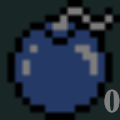
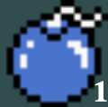
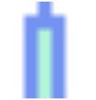
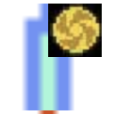
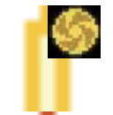
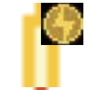
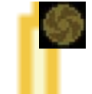

# tracker

## Usage

**Install with npm**

```
npm i

```

**run**

```
npm start
```

**config**

```
To configurate the tracker you need to provide the images and provide
the configuration for each item
```

**config item**

```
The config file is in src/game/gameConfig.json
The main configuration of the tracker look like this:
{
    Items: Array<ConfigItem>
}

ConfigItem {
    type: "COUNT" | "STATE";
    name: string;
    states: Array<string>;
    items: Array<ConfigItem>;
}
```
The config item can be of two different types

The type define the behaviour of the item
```
1) COUNT

{
 "type": "COUNT",
 "name": string (nameOfItem)
}
```



This item will use one image and it will show a count to indicate
how many of that item you have
It will look for the image in resources/nameOfItem/nameOfItem.png

```
2) STATE
 "type": "STATE",
 "name": string (nameOfItem)",
 "states": Array<string> (nameOfState)
```



This item will use one different image for each step
It will look for the image in resources/nameOfItem/nameOfState.png

**config with child items**

Having child items means that you can create a block with items inside
This items inside will behave exactly the same of any item
```
 "type": "STATE" | "COUNT",
 "name": string (nameOfItem)",
 "items: Array<ConfigItem>
```



